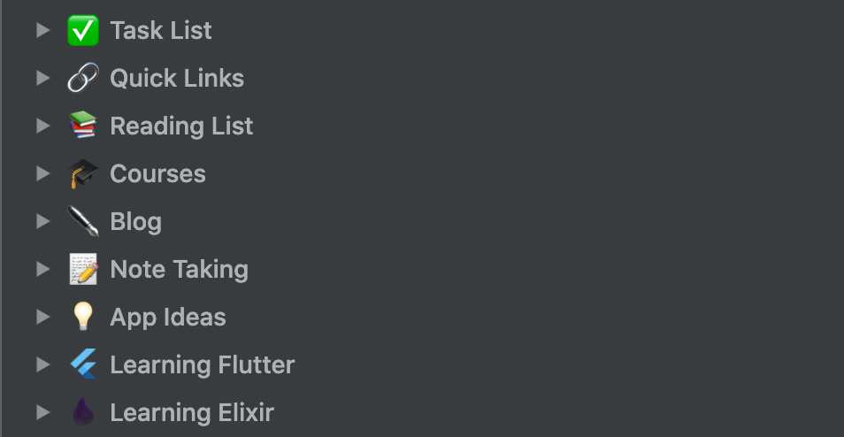
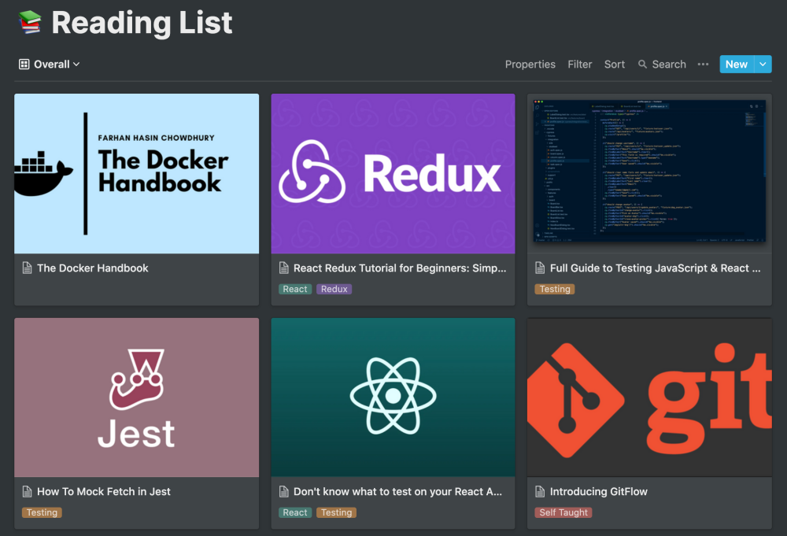
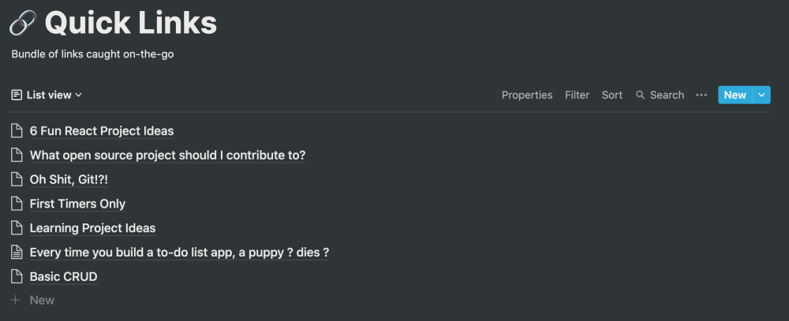
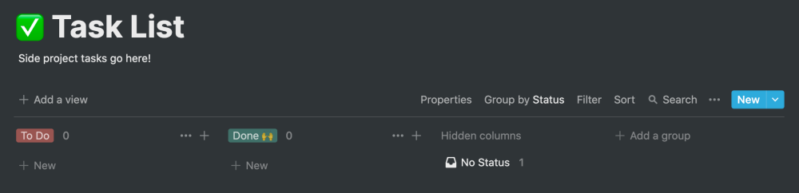
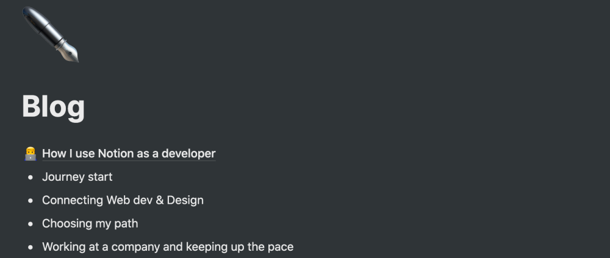
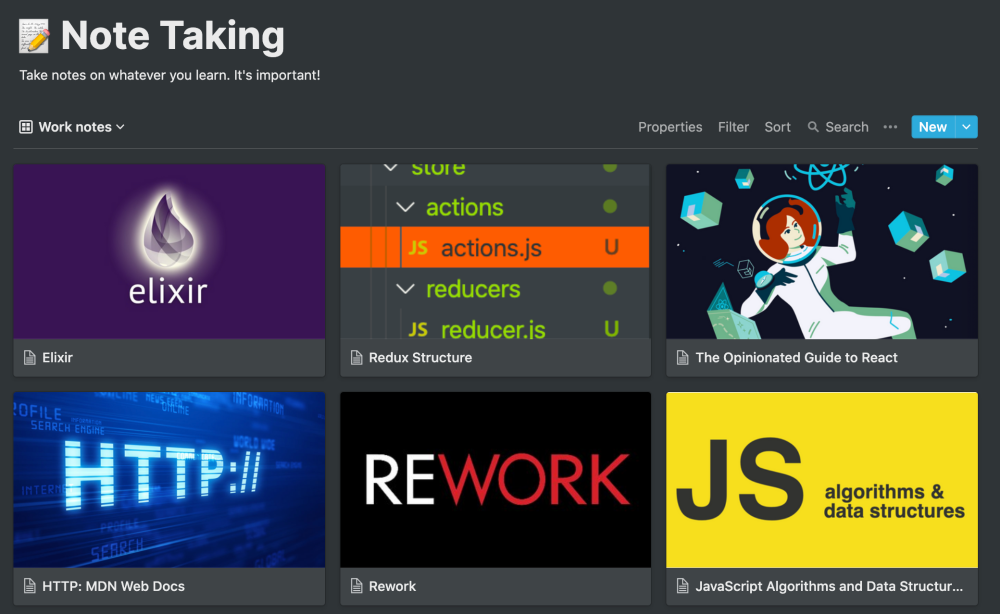
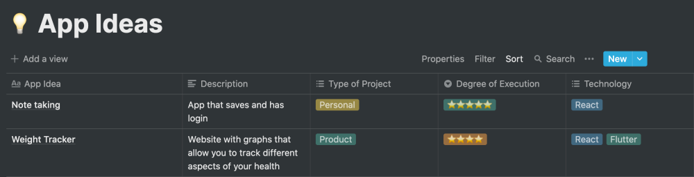
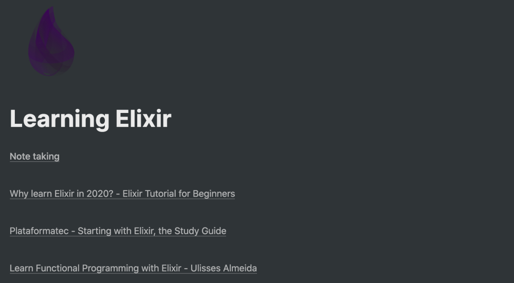

[Notion](https://www.notion.so/) is an amazing tool that helps you organize your work and you can pretty much adjust to all of your needs. Also, there are [a lot of templates](https://www.notion.so/Notion-Template-Gallery-181e961aeb5c4ee6915307c0dfd5156d) to choose from made by incredibly creative people.

## **My Overall Setup**

I use Notion for a lot of stuff (activity tracker, money manager, diary) but it all started when I realized that I had way too many development blog posts saved in my browser's bookmarks. Once I took a clear look at them I said to myself

> There's no way I would ever find here, even if I wanted

So, something had to be done about it and that's when I started using Notion! My first database was **Reading List**.

### **Reading List**

The **Reading List** serves as my organized collection where I put the articles or tutorials that I find interesting for stuff that will surely be useful for my career. More than being a collection of stuff that I haven't read before, it's a collection of stuff that I know will always be useful for me and that I should always take into consideration.

> Yes, a Google search might serve the same purpose but here I'm capable to organize the info as I want

And that's what I do. Since Notion allows you to add tags and filters, it's the perfect way to only what you actually want to see, which facilitates search. I also ended up using Gallery mode because, for me, having a list of links isn't particularly interesting and I want something that is eye-popping and I can find easily. I would say that the images do the trick!

However, I ended up realizing that not everything belongs to the Reading List and they are just stuff that I find around the internet that seems interesting but I don't really have time to read them right when I find them so that's where **Quick Links** appear!

### **Quick Links**

**Quick Links** pretty much represents what I don't want my **Reading List** to look like but when you're on your phone you don't have time to make an incredible-looking database. Instead, you just copy & paste the link and title and you're all set for when you actually have time to study whatever you've found.
It basically serves as a triage for whatever comes into my Notion. The material does the check-in here and then they are properly dropped in their own place! I try to have this page as clean as possible since I don't want to repeat my mistake with the bookmarks!

### **Task List**

I don't like to program my day or even week but, sometimes, when you actually want to have side-projects, you need to organize your life! If you don't, you'll never find the time to work on them so that's why this Task List exists. I mostly use pen and paper for work but for my side projects, considering that I only have the weekends to work on them, it's a great tool and helps me assess the project's progression.

### **Blog**

I think this one is self-descriptive but I write all my content on Notion before assessing if it's good enough to be published. It's also where I take note of topics that I might want to cover or links to other blog posts that I may want to expand upon.

### **Note Taking**

Here stands the important notes that I take (well, duh!) from my **Reading List** or books. Some things aren't worth taking notes on and some others deserve a special place to which I can quickly refer to. For example, **_Rework_** and **_The Opinionated Guide to React_** are two books that I read, enjoyed, and took some notes along the way and I want to preserve them without having to get to the original material again!

### **App Ideas**

I guess that we all have this section on a paper, note app on the phone, or a word document but here stands my quirky ideas for apps, including with technologies that I have no idea on how to work with. Some are supposed to be personal projects, others might turn into actual products. The important part for me here is that I classify these projects on their type (personal or product) and degree of execution (_"As of now, how easily can I build it and how motivated am I to do so?"_). For me, the degree of execution plays a huge part in it because while all ideas are great, I may just not feel incline to elaborate on them... but I don't want to lose them as well.

### **Learning X**

This is basically a sub-division of **Note Taking** but I also insert here resources for these specific technologies. I'm still starting to build a system for this section but at least I have a visible section for something that I'm currently learning and that's the important part!

## **That's pretty much it!**

If you read this far, thank you so much for it! Hopefully, this post ends up helping something that might need some organization in their life!
I usually ramble a lot on [Twitter](https://twitter.com/HeyItzaMi) so you can find me there!
